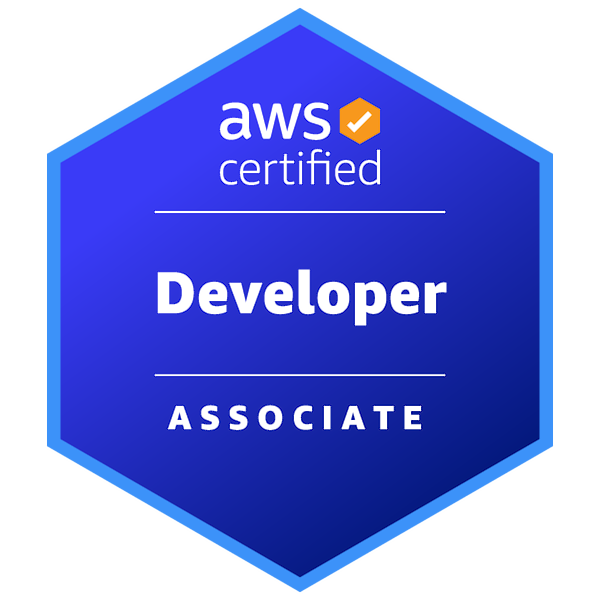

<h1 align="center">Hi 👋, I'm Sri Vaishnavi Remilla</h1>

<h3 align="center">
Computer Science Student | AWS Certified Developer | Cloud & AI Enthusiast
</h3>

 

📧 rsrivaishnavi2006@gmail.com &nbsp; | &nbsp;
📞 +91 8985101828 &nbsp; | &nbsp;
📍 Andhra Pradesh, India

---

## 💫 About Me
🎓 B.Tech Computer Science Engineering (2023–2027)  
🤖 Passionate about Artificial Intelligence & Cloud Computing  
💻 Strong interest in Software Development & Problem Solving  
📚 Strong foundation in Data Structures, Algorithms, DBMS, Operating Systems & Computer Networks  
🌱 Currently exploring **Advanced AWS Services, Generative AI & Docker**  
⚡ I enjoy building scalable cloud applications, AI-powered solutions and modern web applications.  
🎯 Always learning, building, and improving through hands-on projects.

---

## 💻 Tech Stack

### Languages

### Cloud

### Databases

### DevOps & Tools

---
## 🌐 Coding Profiles

---

## 🏆 Certifications

---

## 📊 GitHub Analytics

---
## 📈 Contribution Graph 

 
  
   

 

---

## 📜 Developer Quote

---

<h3 align="center">
✨ Learn • Build • Innovate • Repeat ✨
</h3>
